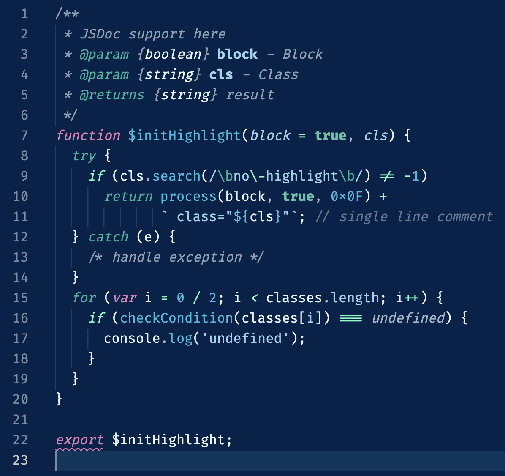
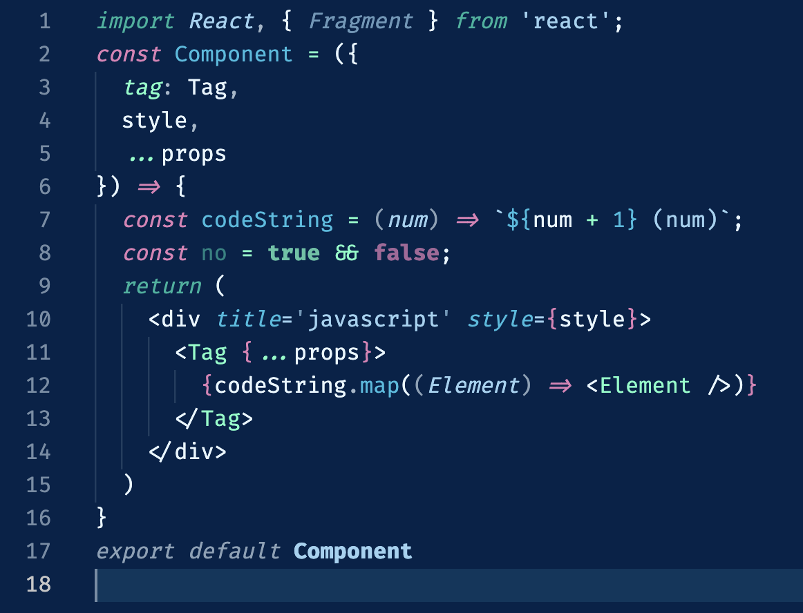
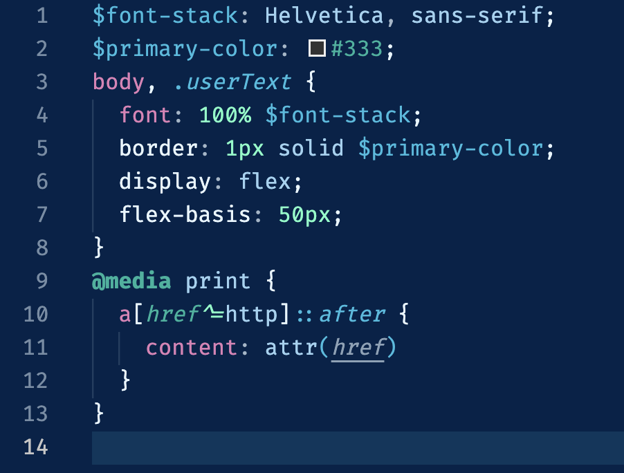

# Replicant

> This color theme was generated by [VSColor](https://kenzie.ink/vscolor/), a tool made by [Kenzie Bottoms](https://kenzie.ink/).

### Palette

- `#00234a`/`#e7f7ff`
- `#72ffc6`
- `#e180b8`
- `#9cd3f1`
- `#2dbde0`
- `#0db39d`

## Supported Languages

- Explicitly written for
    - SCSS
    - Java
    - JavaScript
    - React
    - Python
    - Vue
- Spot-checked for
    - Swift
    - Ruby
- User-approved for
    - Go

## Previews

- [Python](#python)
- [Javascript](#javascript)
  - [React](#react)
- [Ruby](#ruby)
- [SCSS](#scss)
- [Java](#java)
- [Swift](#swift)

### Python

### Javascript

#### React

### Ruby

### SCSS

### Java

### Swift

---

> *Sample code stolen from https://highlightjs.org/*

> *Palette screenshot stolen from https://coolors.co*